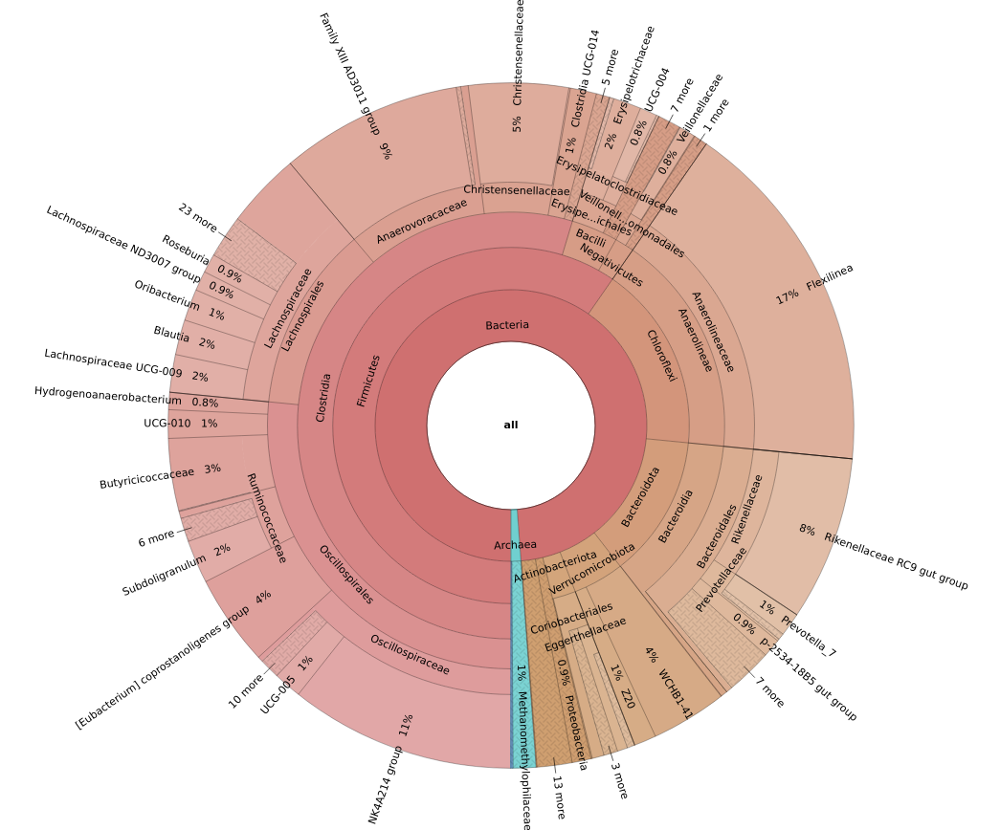
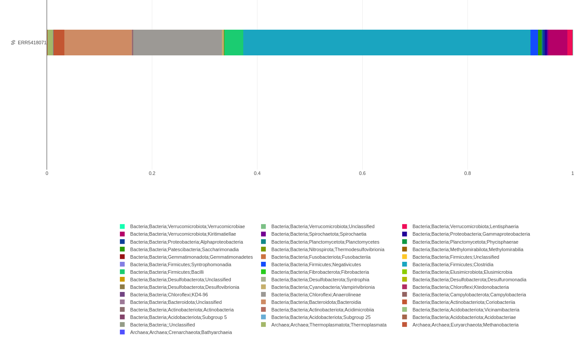
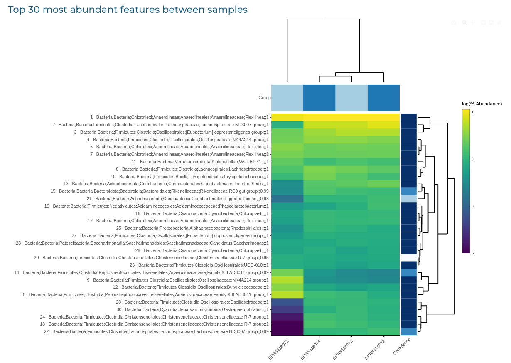

Output
========

The directories and output files listed below can be found inside the the zip file. All paths are relative to the top-level **results** directory.

FastQC
++++++++++++++

FastQC (ver. 0.11.9) gives general quality metrics about your reads. It provides information about the quality score distribution across your reads and per base sequence content (%T/A/G/C). You get information about adapter contamination and other overrepresented sequences.

For further reading and documentation see the `FastQC help <https://www.bioinformatics.babraham.ac.uk/projects/fastqc/Help/>`_.

The FastQC plots displayed in the MultiQC report shows untrimmed reads. They may contain adapter sequences and potentially regions with low quality. 

**Output directory:  <RESULTS>/fastqc/**

    ``<SAMPLE>_fastqc.html``
        FastQC report, containing quality metrics for your untrimmed raw fastq files

Cutadapt
++++++++++++++
The pipeline uses Cutadapt (ver. 3.2) for removal of adapters, primers, poly-A tails and other types of unwanted sequences from high-throughput sequencing reads. If the option checkbox that allows for the possibility to skip the trimming step was marked (in case the samples to be processed have already had their primer sequences removed), these outputs will not be given.

**Output directory: <RESULTS>/cutadapt/**

    ``<SAMPLE>.trimmed.cutadapt.log``
        Log file of the cutadapt process, with statistics regarding the primers trimmed.
    ``cutadapt_summary.tsv``
        Statistics summary file for the whole run.

DADA2
++++++++++++++

DADA2 (ver. 1.20.0) is a fast and accurate algorithm for the inference of ASVs from amplicon data with single-nucleotide resolution.

The database that DADA2 will use to match the inferred ASVs against it and taxonomically classify them will be the `Silva 138 database <https://www.arb-silva.de/documentation/release-138/>`_, due to its extended use in the field of metagenomics. The release 138 of the Silva database allows for the identification of a total 2,225,272 organisms, 1,983,534 of which are from the Bacteria kingdom. In Silva’s `browser <https://www.arb-silva.de/browser/>`_ users can consult the contents of the database.

**Output directory: <RESULTS>/dada2/**

    ``QC/``
        Internal quality control of the assignment, with several statistics and reports.
    ``ASV_seqs.fasta``
        Fasta file of all the different species found in the samples with their OTU ID.
    ``ASV_table.tsv``
        Table file with the number of different ASVs found in each sample.
    ``ASV_tax.tsv``
        Table file with the maximum possible assigned taxonomy (Genus) for each ASV found and its fasta sequence.
    ``ASV_tax_species.tsv``
        Table file with the maximum possible assigned taxonomy (Species) for each ASV found and its fasta sequence.
    ``DADA2_stats.tsv``
        Table file statistics on taxonomy assignment.
    ``DADA2_table.tsv`` and ``DADA2_table.rds``
        Table file containing the same information as the other tables, but in the specific format used for further analysis using R Studio and DADA2 package.
    ``ref_taxonomy.txt``
        Information and citation for the database used (Silva 138).

QIIME2
++++++++++++++
QIIME2 (ver. 2021.2.0) is a next-generation microbiome bioinformatics platform. In this pipeline, several of its algorithms are used to further analyze ASV data obtained from the previous steps.

**Output directory: <RESULTS>/qiime2/**

    ``abundance_tables/``
        ``abs-abund-table-X.tsv``
            Tab-separated absolute abundance table at taxa level X, ranging from 2 to 7 (Kingdom,Phylum, Class, Order, Family, Genus, Species).
        ``count_table_filter_stats.tsv``
            Tab-separated table with information on how much counts were filtered for each sample.
        ``feature-table.biom``
            Abundance table in biom format (general-use format for representing counts of observations in biological samples) for importing into downstream analysis tools.
        ``feature-table.tsv``
            Tab-separated abundance table for each ASV and each sample.
    ``rel_abundance_tables/:`` Absolute abundance tables produced by the previous steps contain count data, but the compositional nature of 16S rRNA amplicon sequencing requires sequencing depth normalization. This step computes relative abundance tables for various taxonomic levels and detailed tables for all ASVs with taxonomic classification, sequence and relative abundance for each sample. Typically used for in depth investigation of taxa abundances.
        ``rel-abund-table-X.tsv``
            Tab-separated absolute abundance table at taxa level X, ranging from 2 to 7 (Kingdom,Phylum, Class, Order, Family, Genus, Species).
        ``rel-table-ASV.tsv``
            Tab-separated relative abundance table for all ASVs.
        ``rel-table-ASV_with-DADA2-tax.tsv``
            Tab-separated table for all ASVs with DADA2 taxonomic classification, sequence and relative abundance.
    ``representative_sequences/``
        ``rep-seq.fasta``
            Fasta file with ASV sequences found in the samples.
        ``descriptive_stats.tsv``
            Length, mean, etc. of ASV sequences.
        ``seven_number_summary.tsv``
            Length of ASV sequences in different quintiles.
    ``barplot/``
        ``index.html``
            Interactive barplot for taxa relative abundance per sample at the distinct taxonomic levels. Can be viewed in a web browser to aid exploration of taxa discovered in samples. Allows for sorting using associated metadata.
    ``alpha-rarefaction/``
        ``index.html``
            Interactive plot of alpha rarefaction curves (one per metadata category) for taxa abundance per sample with distinct alpha diversity indices. Can be viewed in a web browser to determine if the richness of the samples has been fully observed.
    ``phylogenetic_tree/``
        ``tree.nwk``
            Phylogenetic tree in newick format.
        ``rooted-tree.qza``
            Phylogenetic tree in QIIME2 format.
    ``diversity/``
        ``alpha_diversity/:`` Alpha diversity measures the species diversity within samples. It is calculated using various methods and pairwise comparisons of groups of samples are performed.
            ``evenness_vector/index.html:``
                Pielou’s Evenness.
            ``faith_pd_vector/index.html:``
                Faith’s Phylogenetic Diversity.
            ``observed_otus_vector/index.html:``
                Observed OTUs.
            ``shannon_vector/index.html:``
                Shannon’s diversity index.
        ``beta_diversity/:`` Beta diversity measures the species community differences between samples. Distances are calculated using various methods and pairwise comparisons of groups of samples are performed.
            ``<METHOD>_pcoa_results-PCoA/index.html:`` Interactive PCoA plot. Can be viewed in a web browser to assess and represent dissimilarity between samples. Method will be any of the following distance metrics methods: Binary Jaccard distance, Bray-Curtis distance, unweighted UniFrac distance, weighted UniFrac distance.

Krona plots
++++++++++++++
We use KronaTools (ver. 2.8.1) to create a very informative visualization of the absolute abundances of species for each sample, in HTML format to facilitate exploration.

**Output directory: <RESULTS>/Krona_plots/**

    ``<SAMPLE>.plot.html``
        HTML report with the interactive krona plot for each sample of the run.

**Sample krona plot:**

Sample report
++++++++++++++++

Aggregated sample report in HTML format.

**Output directory: <RESULTS>/Samples_report/**

    ``<SAMPLE>.html``
        Report with information about all steps per sample. It provides information about the number of sequences, sequences trimmed, assigned taxonomy and ASVs found.

**Sample taxonomy assignment:**

Analysis report
++++++++++++++++++
Aggregated report of all the samples, containing alpha and beta-diversity measures and a clustered heatmap.

**Output directory: <RESULTS>/Run_report/**
    ``run.html``

**Sample clustered heatmap:**

MultiQC
++++++++++++++
MultiQC (ver. 1.10.1) is a visualization tool that generates a single HTML report summarizing all QC information for all the samples in your project.

The pipeline has special steps which allow the software versions used to be reported in the MultiQC output for future traceability.

**Output directory: <RESULTS>/multiqc/**

    ``general.report.html``
        MultiQC report - a standalone HTML file that can be viewed in a web browser.

Pipeline information
++++++++++++++++++++++
The pipeline also provides a table listing software used and their respective versions.

**Output directory: <RESULTS>/pipeline_info/**

    ``software_versions.tsv``