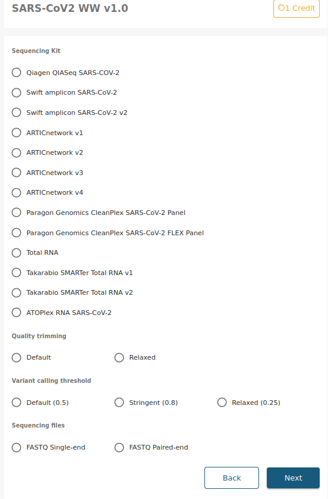
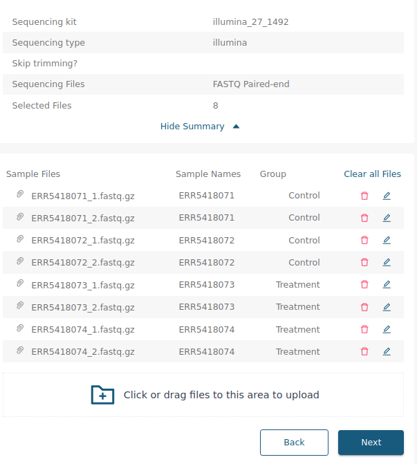

Usage
========

.. _input:

Input
------------

When submitting a job to the 16S pipeline, you will be presented with the following screen:

.. _options:

Options
------------

Sequencing kit
+++++++++++++++++

Here you can select the sequencing kit used to obtain the data. We currently have the following sequencing kits and oligos available, but if the kit your are looking for is not in the list, do not hesitate to contact us and we will add it as soon as possible.

* **16S V1-V9 Primer Constructs (27F-1492R)**
   * **Forward sequence**: AGAGTTTGATCMTGGCTCAG
   * **Reverse sequence**: TTCAGCATTGTTCCATTGG
* **16S V1-V9 Primer Constructs (27F-1495R)**
   * **Forward sequence**: GAGAGTTTGATCCTGGCTCAG
   * **Reverse sequence**: AGCATTGTTCCATCGGCATC
* **16S V3-V4 Primer Constructs (341F-785R)**
   * **Forward sequence**: CCTACGGGNGGCWGCAG
   * **Reverse sequence**: GACTACHVGGGTATCTAATCC
* **16S V3-V4 Primer Constructs (341F-805R)**
   * **Forward sequence**: CCTACGGGNGGCWGCAG
   * **Reverse sequence**: GGATTAGATACCCVHGTAGTC
* **16S V3-V4 Primer Constructs (515F-806R)**
   * **Forward sequence**: GTGYCAGCMGCCGCGGTAA
   * **Reverse sequence**: GGACTACNVGGGTWTCTAAT
* **ITS NL4 fungal primers**:
   * **Forward sequence**: TCCGTAGGTGAACCTGCGG
   * **Reverse sequence**: GGTCCGTGTTTCAAGACGG
* **Perkinelmer Nextflex v4 16S amplicon kit 2.0**
   * **Forward sequence**: GACGCTCTTCCGATCTTATGGTAATTGTGTGCCAGCMGCCGCGGTAA
   * **Reverse sequence**: TGTGCTCTTCCGATCTAGTCAGTCAGCCGGACTACHVGGGTWTCTAAT
* **xGen 16S NGS Amplicon sequencing kit.**
   * The xGen 16S rRNA v2 Amplicon Panel targets V1–V9 variable regions of the 16S rRNA gene.

Sequencing type
++++++++++++++++++

Here you can select the sequencing platform used for obtaining the data. We currently have full support for data obtained using **Illumina** platforms. The options for **PacBio** and **IonTorrent** are still under development and may not work perfectly, but are available.

Skip trimming
++++++++++++++++++

Only select this option if your FASTQ files have already had the amplicon primers trimmed, otherwise leave it unchecked.

Sequencing files
++++++++++++++++++++

Select whether your data is single-end or paired-end.

Accepted sample names
-------------------------

Stratus web server uses the last characters on the file name to determine which mate is which in paired-end data. This is why the accepted file terminations are the following:

* _1.fastq.gz and _2.fastq.gz
* _1.fq.gz and _2.fq.gz

For single-end samples the accepted terminations are the same but without the mate information.

Grouping
------------

When clicking `Next` in the option screen, the file uploading screen will show up. Once the FASTQ files have been selected (either by drag-and-drop or selection via file explored), you will be asked to input the grouping condition for the samples. This information is needed in order to perform alpha and beta-diversity analysis, 

Leaving the `Group` column empty will be interpreted as missing data and some diversity analysis will not be performed. If samples do not have a defined grouping condition we recommend setting the `Group` column value to the same value (eg. Control, Default, etc). This way, some diversity analysis will still be performed.

An example of the input expected on this menu can be found in the screenshot below. Here we have uploaded four paired-end samples, two of them belonging to the "Control" group, and the other two belonging to the "Treatment" group. Thanks to this, the pipeline will be able to perform both alpha-diversity analysis (calculating the diversity within a sample) and also beta-diversity analysis (calculating the diversity between different samples and groups).

Launching
------------

Once all the options and grouping conditions have been selected, by clicking next the sample upload will begin and the analysis pipeline will launch!

An email will be received once the analysis are finished and the results will be available on the web server.
